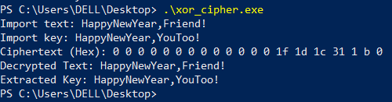

---
## Front matter
lang: ru-RU
title: Презентация по лабораторной работе №7
subtitle: Элементы криптографии. Однократное гаммирование
author: "Ле Тиен Винь"
institute:
  - Российский университет дружбы народов, Москва, Россия
date: 05 Октября 2024

## i18n babel
babel-lang: russian
babel-otherlangs: english

## Formatting pdf
toc: false
toc-title: Содержание
slide_level: 2
aspectratio: 169
section-titles: true
theme: metropolis
header-includes:
 - \metroset{progressbar=frametitle,sectionpage=progressbar,numbering=fraction}
 - '\makeatletter'
 - '\beamer@ignorenonframefalse'
 - '\makeatother'
---

# Информация
:::::::::::::: {.columns align=center}
::: {.column width="70%"}
  * Ле Тиен Винь
  * Cтудент
  * Российский университет дружбы народов
  * [1032215241@pfur.ru](mailto:1032215241@rudn.ru)
  * https://github.com/tvle2000/information
  
:::
::: {.column width="30%"}

:::
::::::::::::::

# Цель работы

Освоить на практике применение режима однократного гаммирования.

# Задание

Нужно подобрать ключ, чтобы получить сообщение «С Новым Годом, друзья!». Требуется разработать приложение, позволяющее шифровать и дешифровать данные в режиме однократного гаммирования. Приложение должно:

1. Определить вид шифротекста при известном ключе и известном открытом тексте.

2. Определить ключ, с помощью которого шифротекст может быть преобразован в некоторый фрагмент текста, представляющий собой один из возможных вариантов прочтения открытого текста.

# Выполнения работы

- Мы используем метод шифрования: Выполнение операции сложения по модулю 2 (XOR)

- Поскольку такой метод шифрования является симметричным, так как двойное прибавление одной и той же величины по модулю 2 восстанавливает исходное значение, а шифрование и расшифрование выполняется одной и той же программой

# Выполнения работы

#

- Функция преобразует каждый элемент введенного текста в новый элемент, зашифрованный на основе ключа, с помощью операцией сложения по модулю 2 (XOR): Ci = Pi + Ki

- Где Ci — i-й символ получившегося зашифрованного послания, Pi — i-й символ открытого текста, Ki — i-й символ ключа, i = 1, ..., m

# Выполнения работы

#

- Функция определяет ключ, когда известен открытый текст и зашифрованный текст, на основе XOR: Ki = Ci + Pi

- Если известны шифротекст и открытый текст, то задача нахождения ключа решается также в соответствии с (1), а именно, обе части равенства необходимо сложить по модулю 2 с Pi: Ci + Pi = Pi + Ki + Pi = Ki

# Выполнения работы

#

- В main мы будем собирать данные с клавиатуры

- Используовать функцию "xorOperator" для генерации зашифрованного текста и вывода зашифрованного текста на экран

- Используовать функцию "xorOperator", чтобы расшифровать зашифрованный текст и вывести исходный текст на экран

- Используовать ранее созданный зашифрованный текст и исходный текст, чтобы найти ключ и вывести исходный текст на экран

# Результат программы

# Вывод

После лаборатоной работы я получил практические навыки по применение режима однократного гаммирования
