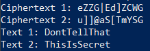

---
## Front matter
title: "Отчёт по лабораторной работе №8"
subtitle: "Элементы криптографии. Шифрование (кодирование) различных исходных текстов одним ключом"
author: "Ле Тиен Винь"

## Generic otions
lang: ru-RU
toc-title: "Содержание"

## Bibliography
bibliography: bib/cite.bib
csl: pandoc/csl/gost-r-7-0-5-2008-numeric.csl

## Pdf output format
toc: true # Table of contents
toc-depth: 2
lof: false # List of figures
lot: false # List of tables
fontsize: 12pt
linestretch: 1.5
papersize: a4
documentclass: scrreprt
## I18n polyglossia
polyglossia-lang:
  name: russian
  options:
	- spelling=modern
	- babelshorthands=true
polyglossia-otherlangs:
  name: english
## I18n babel
babel-lang: russian
babel-otherlangs: english
## Fonts
mainfont: PT Serif
romanfont: PT Serif
sansfont: PT Sans
monofont: PT Mono
mainfontoptions: Ligatures=TeX
romanfontoptions: Ligatures=TeX
sansfontoptions: Ligatures=TeX,Scale=MatchLowercase
monofontoptions: Scale=MatchLowercase,Scale=0.9
## Biblatex
biblatex: true
biblio-style: "gost-numeric"
biblatexoptions:
  - parentracker=true
  - backend=biber
  - hyperref=auto
  - language=auto
  - autolang=other*
  - citestyle=gost-numeric
## Pandoc-crossref LaTeX customization
figureTitle: "Рис."
tableTitle: "Таблица"
listingTitle: "Листинг"
lofTitle: "Список иллюстраций"
lotTitle: "Список таблиц"
lolTitle: "Листинги"
## Misc options
indent: true
header-includes:
  - \usepackage[T2B]{fontenc}
  - \usepackage{indentfirst}
---

# I.Цель работы

Освоить на практике применение режима одноключевого кодирования на примере кодирования различных исходных текстов одним ключом.

# II. Задание

Два текста кодируются одним ключом (однократное гаммирование). Требуется не зная ключа и не стремясь его определить, прочитать оба текста. Необходимо разработать приложение, позволяющее шифровать и дешифровать тексты P1 и P2 в режиме однократного гаммирования. Приложение должно определить вид шифротекстов C1 и C2 обоих текстов P1 и P2 при известном ключе ; Необходимо определить и выразить аналитически способ, при котором злоумышленник может прочитать оба текста, не зная ключа и не стремясь его определить.

# III. Выполнение задания

## Код приложения

```C++
#include <iostream>
#include <string>
using namespace std;

string xorOperator(const string &input, const string &key) {
    string output = input;
    for (size_t i = 0; i < input.size(); ++i) {
        output[i] = input[i] ^ key[i % key.size()];
    }
    return output;
}

int main() {
    string P1 = "ThisIsSecret";
    string P2 = "DontTellThat";
    string key = "123456789123";
       
    string ciphertext1 = xorOperator(P1, key);
    string ciphertext2 = xorOperator(P2, key);

    cout << "Ciphertext 1: " << ciphertext1 << endl;
    cout << "Ciphertext 2: " << ciphertext2 << endl;

    string Text1 = xorOperator(xorOperator(ciphertext1,ciphertext2),P1);
    string Text2 = xorOperator(xorOperator(ciphertext1,ciphertext2),P2);

    cout << "Text 1: " << Text1 << endl;
    cout << "Text 2: " << Text2 << endl;

    return 0;
}
```

## Анализ кода

- Мы используем метод шифрования: Выполнение операции сложения по модулю 2 (XOR).

```C++
string xorOperator(const string &input, const string &key) {
    string output = input;
    for (size_t i = 0; i < input.size(); ++i) {
        output[i] = input[i] ^ key[i % key.size()];
    }
    return output;
}
```

- Функция преобразует каждый элемент введенного текста в новый элемент, зашифрованный на основе ключа, с помощью операцией сложения по модулю 2 (XOR): Ci = Pi + Ki (1).

- Где Ci — i-й символ получившегося зашифрованного послания, Pi — i-й символ открытого текста, Ki — i-й символ ключа, i = 1, ..., m.

```C++
int main() {
    string P1 = "ThisIsSecret";
    string P2 = "DontTellThat";
    string key = "123456789123";
       
    string ciphertext1 = xorOperator(P1, key);
    string ciphertext2 = xorOperator(P2, key);

    cout << "Ciphertext 1: " << ciphertext1 << endl;
    cout << "Ciphertext 2: " << ciphertext2 << endl;

    string Text1 = xorOperator(xorOperator(ciphertext1,ciphertext2),P1);
    string Text2 = xorOperator(xorOperator(ciphertext1,ciphertext2),P2);

    cout << "Text 1: " << Text1 << endl;
    cout << "Text 2: " << Text2 << endl;

    return 0;
}
```

- В main мы определем 2 исходного текста с называниями P1 и P2 и ключ key.

- Используовать функцию "xorOperator" для генерации зашифрованного текста и вывода зашифрованного текста на экран.

- В ситуации, когда злоумышленник знал один из двух текста, он может прочитать остальный, не зная ключа и не стремясь его определить, на основе свойства операции XOR: 1 + 1 = 0, 1 + 0 = 1.

- Получаем С1 + С2 = P1 + K + P2 + K = P1 + P2, следует C1 + C2 + P1 = P1 + P2 + P1 = P2.

## Результат программы



# IV. Вывод

После лаборатоной работы я получил практические навыки по применению режима одноключевого кодирования на примере кодирования различных исходных текстов одним ключом.
